# nosql-challenge 
A project that uses PyMongo to create and make changes to a NoSql database as well as make queries for insight analyses. 
 
 
 

## Table of Contents
#### Introduction
#### Requirements & Dependencies
#### Analysis and Results
#### Usage
#### Contributing
#### License
 

#### Introduction
This NoSQL project demonstrates skills to create a restaurant database with a JSON file via Terminal, and use PyMongo in a Jupyter Notebook to make changes in the database as well as make queries for insightful analysis.

#### Features
- Create databse via Terminal. 

- Insert, update, and delete documents from the database. 

- Convert  datatypes in the database. 

- Use Regex/create pipelines.

- Create DataFrame from query results. 

 

#### Requirements & Dependencies
You will need the following software to run the two Jupyter Notebook scripts:
- Python 3.10
- Pandas
- PyMongo
- Pretty Print
 

## Project Structure
 

## **Part 1.** 
##### Database and Jupyter Notebook Setup
 
1. Import dependencies and create an instance of MongoClient. 
 
 
2. Navigate to Resources folder and type 'mongoimport --type json -d uk_food -c establishments --drop --jsonArray establishments.json' to create and load the uk_food database.
 
 
3. Check that the 'uk_food' database was created with the 'establishments' collection. 
  

 
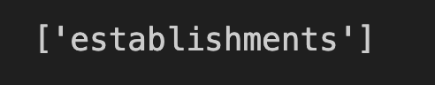
 
 

4. Review one document in the collection. 
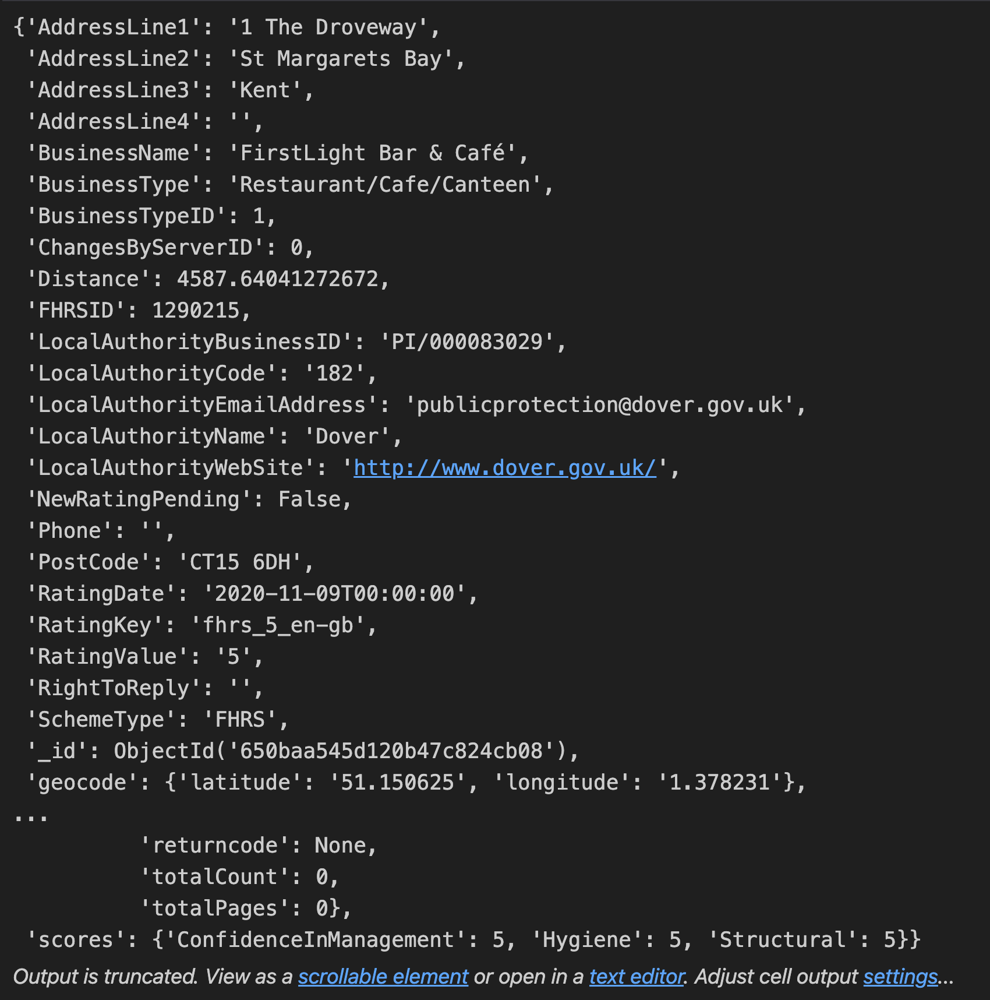
 
 
 
 

## **Part 2.** 
##### Update the Database
 
1. Create a dictionary for a new restaraunt 'Penang Flavours' and insert the restaurant into the collection. 
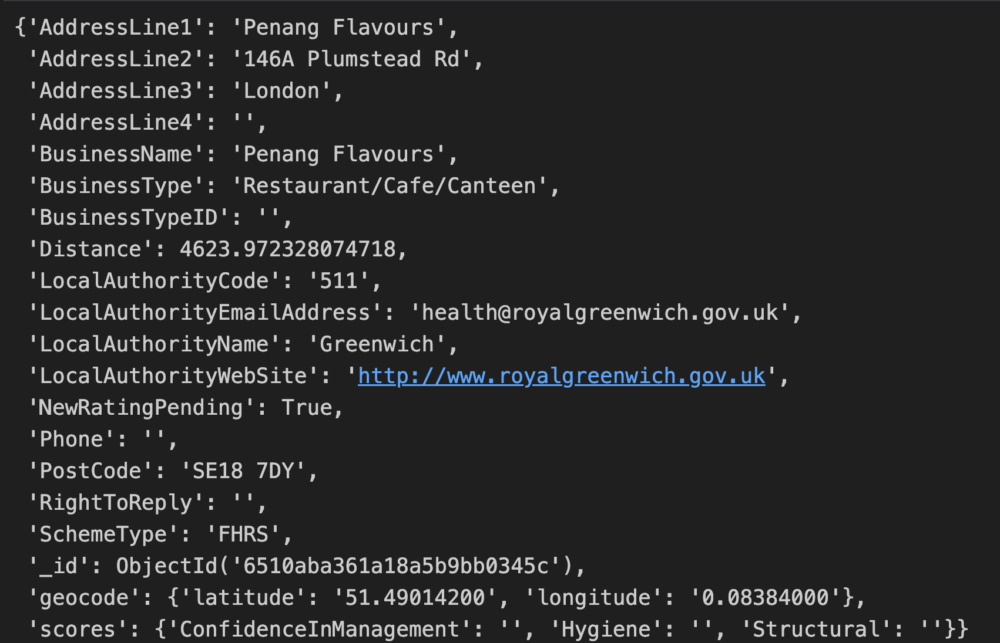
 
 

2. Check ten restaurants to determine the 'BusinessTypeID' for 'Restaurant/Cafe/Canteen'.
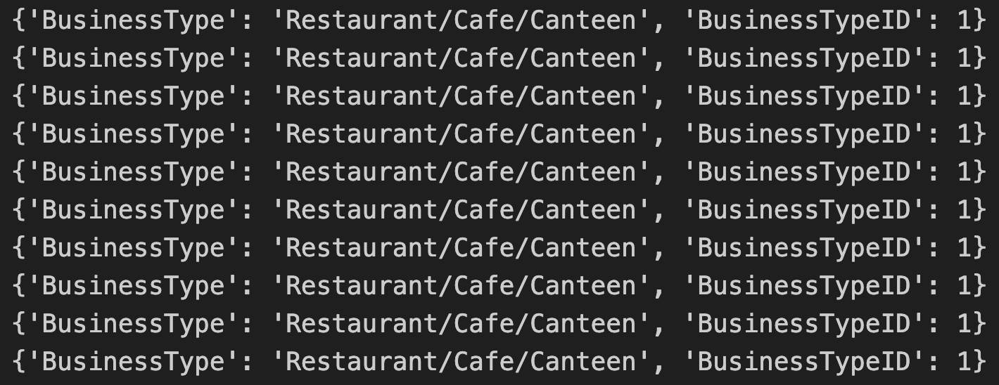
 
 

3. Update Penang Flavours' Business Type ID, and check the document. 
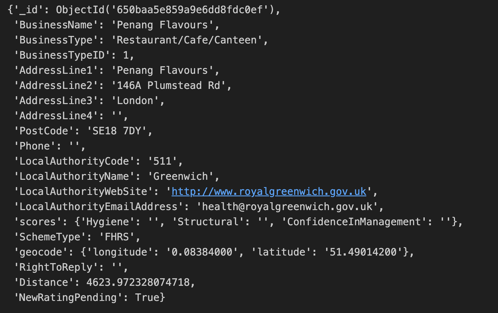
 
 

4. i. Check the number of documents with 'Dover' as the local authority. 
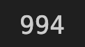
 
  ii. Drop all the documents with 'Dover' as the local authority. 
 
  iii. Check that there are no documents remaining with 'Dover' as the local authority.

 
 
iv. Use 'find_one' to check that documents are remaining in the database. 
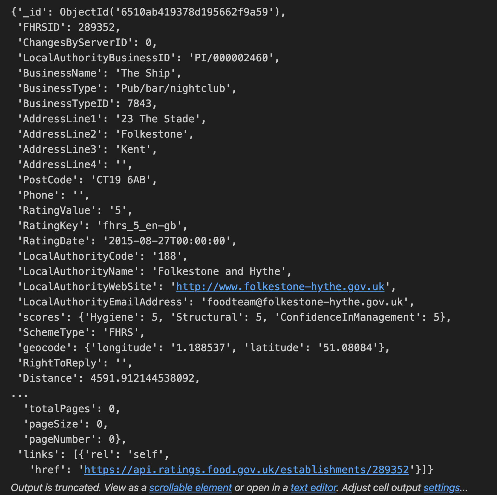
 
 
5. i. Use `update_many` to convert `latitude` and `longitude` to decimal numbers.
 
ii. Use `update_many` to set non 1-5 rating values to null. 
 
iii. Use 'update_many' to convert rating value data type to integer.  
 
iv. Check that the coordinates and rating values are now numeric.
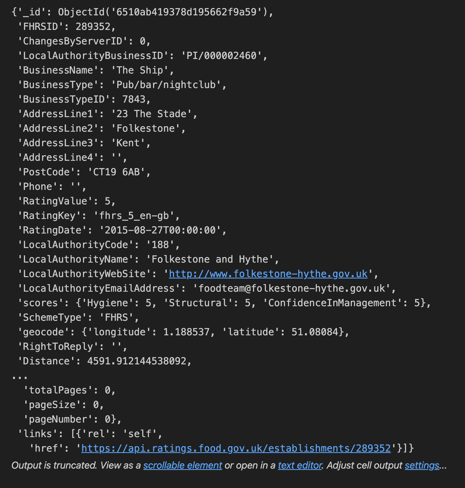 
 

## **Part 3.** 
##### Exploratory Analysis
 
1.
 
i. Query how many restaurants have a hygiene score of 20. 

 
 

ii. Print out the first restaurant in the query. 
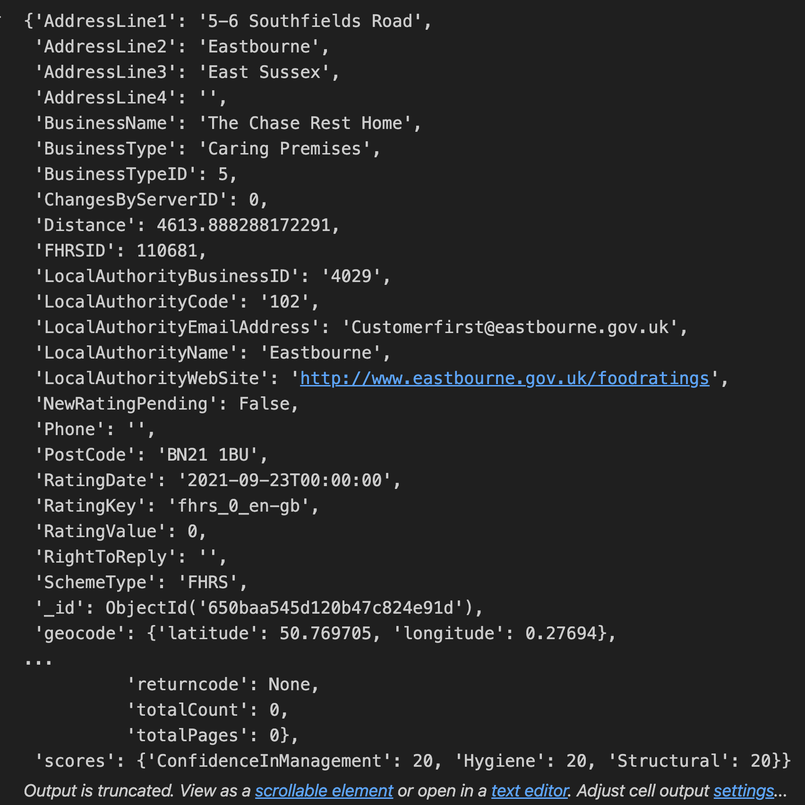 
 
 

iii. Create a DataFrame from the query and check the length and head. 
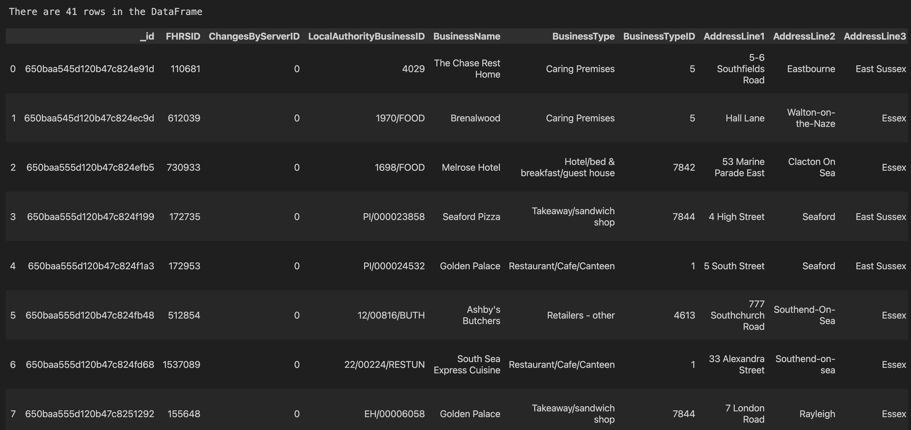 
 
 

2.
 
i. Query how many restaurants in London have a `RatingValue` greater than or equal to 4?
 
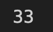 
 
 

ii. Print out the first restaurant in the query. 
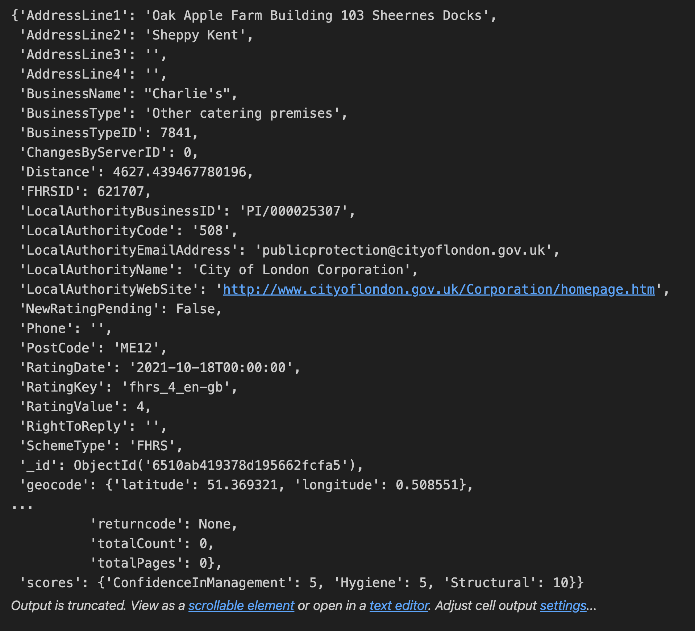 
 
 

iii. Create a DataFrame from the query and check the length and head. 
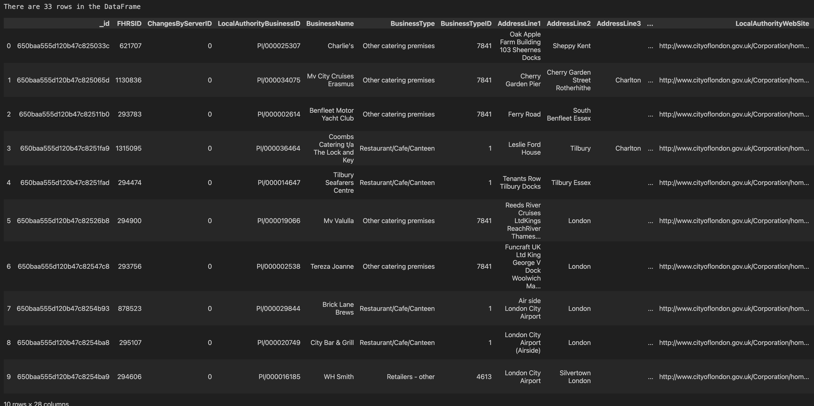 
 
 

3.
 
i. Query the top 5 establishments with a rating value of 5, sorted by lowest hygiene score, nearest to Penang Flavours. 
 
ii. Print the results, then create a DataFrame.
 
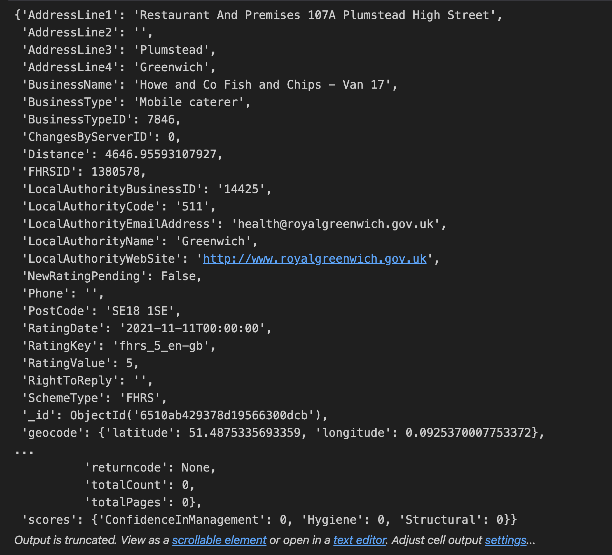 
 
 

4.
ii. Use a pipeline to find out how many establishments in each local authority have a hygiene score of zero? 
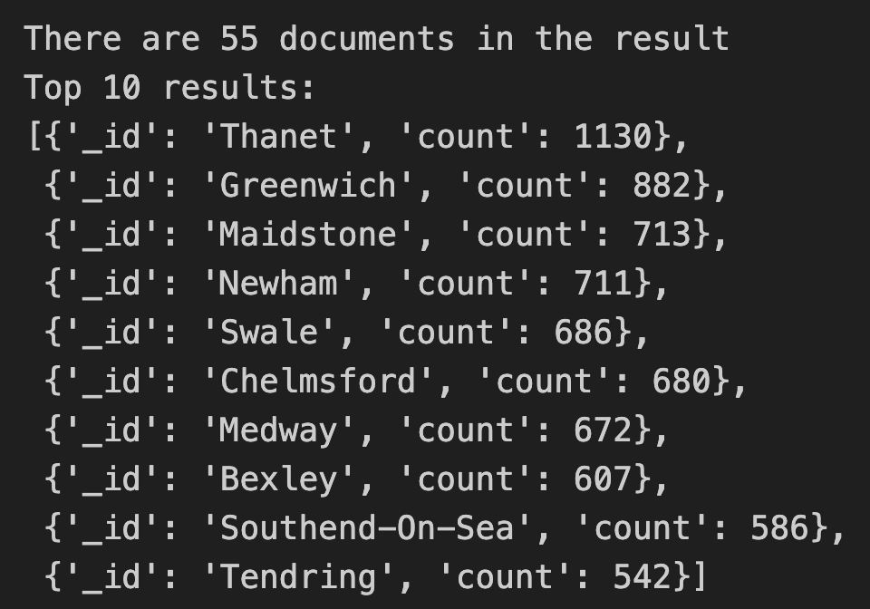 
 
 

iii. Create a DataFrame from the query and check the length and head. 
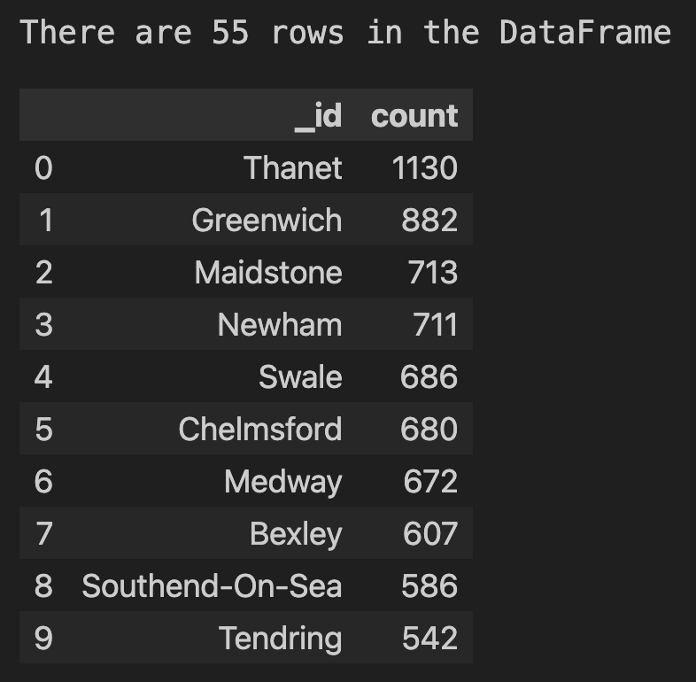 
 
 
 
 
---

#### Usage
1. Set up all software requirements 
2. Ensure that you have the appropriate JSON file to create the database.
3. Run the setup script first, and then the analysis script step by step in Jupyter Notebook. 
- Be careful when running the scripts to avoid over-querying the database. 

#### Contributions
Contributions to this project are highly encouraged! If you wish to contribute, please follow these guidelines:

- Fork the nosql-challenge repository and clone it locally.
- Create a new branch for your feature or bug fix.
- Commit your changes with descriptive commit messages.
- Push your branch to your forked repository.
- Submit a pull request to the original repository.
- Please ensure that your code adheres to the project's coding style and conventions.

If you encounter any issues or have suggestions for improvements, please open an issue on the GitHub repository.

### License
These projects are licensed under the MIT License. Feel free to use, modify, and distribute the code as per the terms of the license. 